# Hi there, I'm Sahil👋
## Ecommerce-Grocery-Application

"E-Commerce(Electronic Commerce) is a process of doing business through computer networks. The primary goal of an e-commerce site is to sell goods and services online. Online Shopping is a form of electronic shopping store where the buyer can directly communicate to the seller's usually via the internet"

Technologies used for developing the project are :

1. JSP & Servlet

2. MySQL

3. BootStrap

4. JavaScript

The project basically has two modules:
1) CUSTOMER MODULE
2) ADMIN MODULE

Let's see the project in detail.

[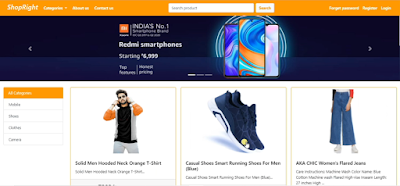]()

So this is our HOME PAGE user can see all the product which are available on the e-commerce website.

He can also see the products based on the categories which are available on the website.

[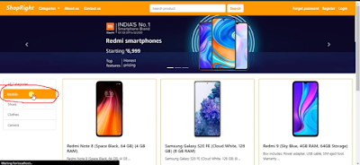]()

So here user can see the products based on the categories like we can see when the user clicks on a mobile category all the products which are under the mobile category will get displayed on the screen.

In a similar manner, when we click on other categories all the product-related that category will get displayed on the screen.

And if want user can also search products from the header part. Let's suppose the user search red, so all the products which contain red in their product title will get displayed on the screen.

If we see the product on the screen we are able to see the product title, product image, price, discount, quantity. And if we see a product description after some words I have added 3 dots. Because If I try to add the whole description here only then it takes too much space and thereby it will not look good.

But If a user wants to see the whole description he can open that product.

[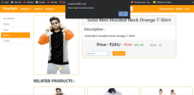]()

So users can see whole details here and below the selected product we will be able to see RELATED PRODUCTS.

But, now the user has to log in as a customer to buy the product otherwise we will get the message as "Please login to buy the product."

At header part i.e at navbar beside the search option we have about page, contact us, forget password, register, and login option. 

And Now Let's Register as a Customer. Here all the fields on the registration page are validated.

[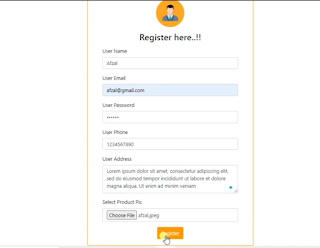]()

So after registration, we will get the message "REGISTRATION SUCCESSFUL" and name's details will get added to the database.
Now we again try to register as same names's email Id then we will get message as "THIS USER IS ALREADY  REGISTERED".

Now if we try to login as the wrong email Id we will get the message as "THIS USER IS NOT REGISTERED".

Let's login by entering proper details.

[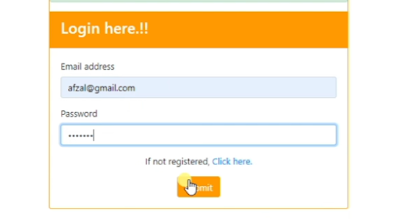]()

Here, after log in as a customer, we will able to see some more option at the header(Navigation bar) like cart, my orders, change password and logout.

[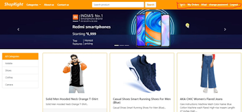]()

Now user can buy the product. So let's add some products to the cart. 
[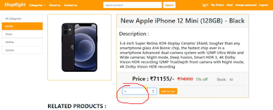]()

Here are some other relevant--
[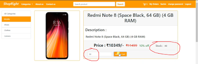]()
[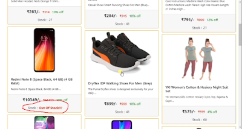]()

Admin Page--
[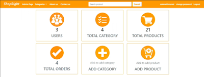]()
[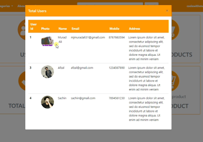]()
[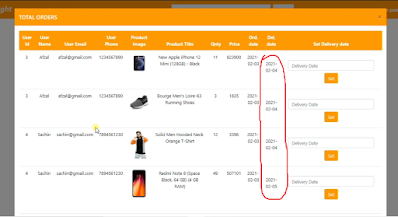]()
[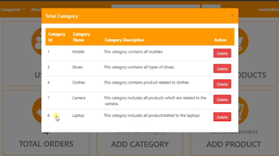]()
[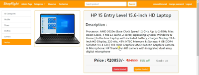]()

## Deployment

All the required dependencies are listed in the requirements.txt file.
Just Download the TOmcat Server and run in Eclipse.

## Support

For support, email mailtosahil18@gmail.com.

## I'm a student at Bits Pilani Goa Campus!!
- 🌱 I’m currently learning everything 🤣
- 🥅 2022 Goals: Learn more about web3
- ⚡ Fun fact: I like to draw and play guitar/drums

### Connect with me:

&nbsp;&nbsp;

&nbsp;&nbsp;

&nbsp;&nbsp;

&nbsp;&nbsp;

